# TD 1 : Image Classification 

MOD 4.6 Deep Learning & Artificial Intelligence: an introduction
Basile DARNE
***

## Description

This project is composed of 3 different part. 

- The first part aims at reading the Cifar-10 dataset and extracting from it training and testing data. It is implemented in the file `read_cifar.py`.
- The second is supposed to run a k-nearest-neighboors classification over this data, it is implemented in the file `read_cifar.py`.
- The third part is implemented in the file `mlp.py`, and it runs a classification using an artificial neural network composed of 1 hidden layer.

## Usage
### Prepare the CIFAR dataset

The image database used for the experiments is CIFAR-10 which consists of 60 000 color images of size 32x32 divided into 10 classes (plane, car, bird, cat, ...).
This database can be obtained at the address https://www.cs.toronto.edu/~kriz/cifar.html where are also given the indications to read the data.
The downloaded `cifar-10-batches-py` folder is moved in the folder named `data`

### KNN classifier

We execute the algorithm for k (the nearest neighbour number) going from 1 to 20 and obtain the following results :

### Artificial Neural Network

The objective is to develop a classifier based on a multilayer perceptron (MLP) neural network.

#### First example

The first example shows the principle of this classifier on one input vector. We calculate the successive gradients used in the gradient descent.
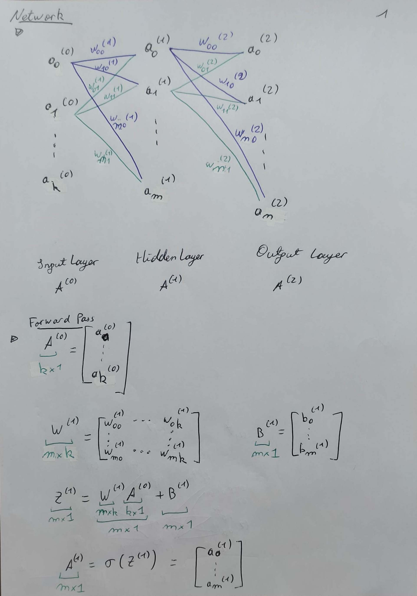
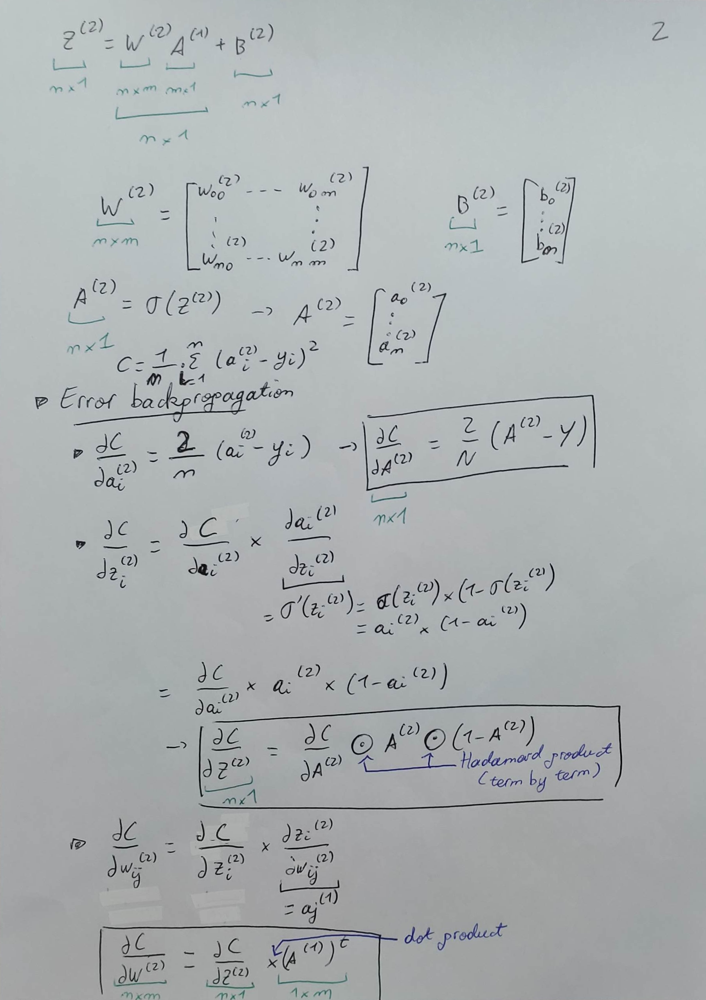
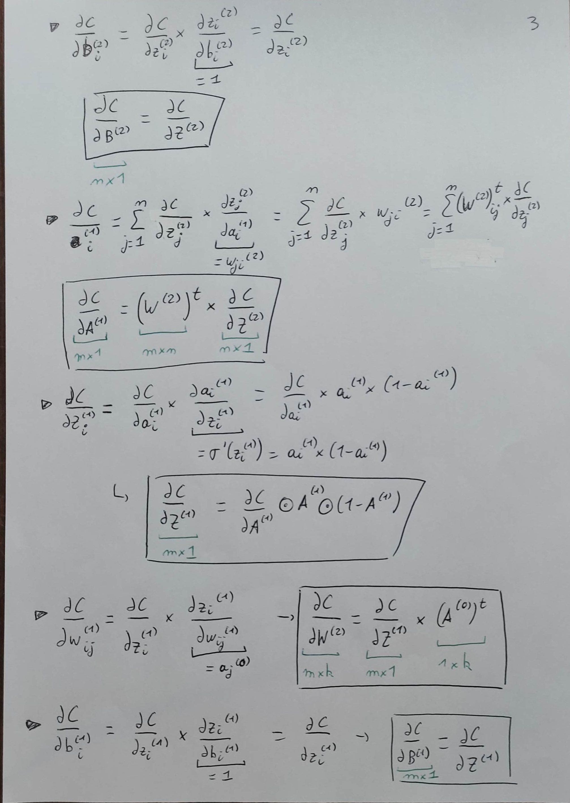

#### Elaborated examples

Then we consider a batched input and rewrite the expressions. 
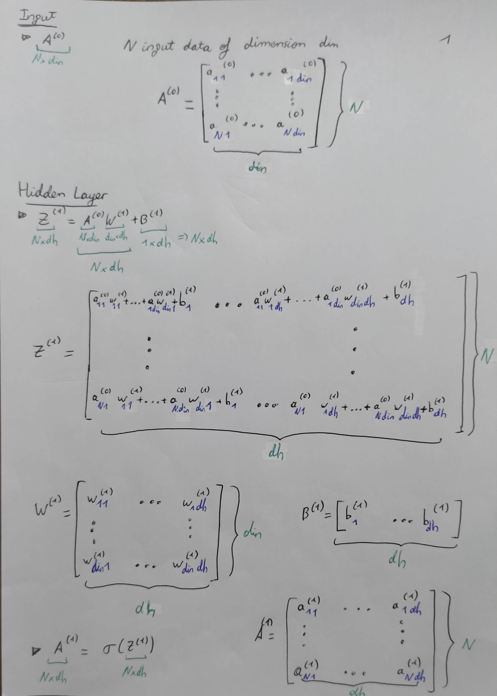
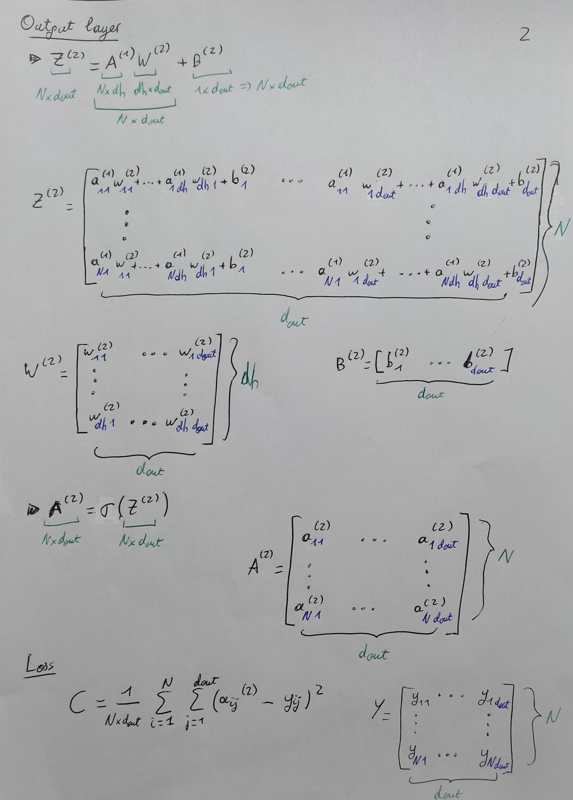
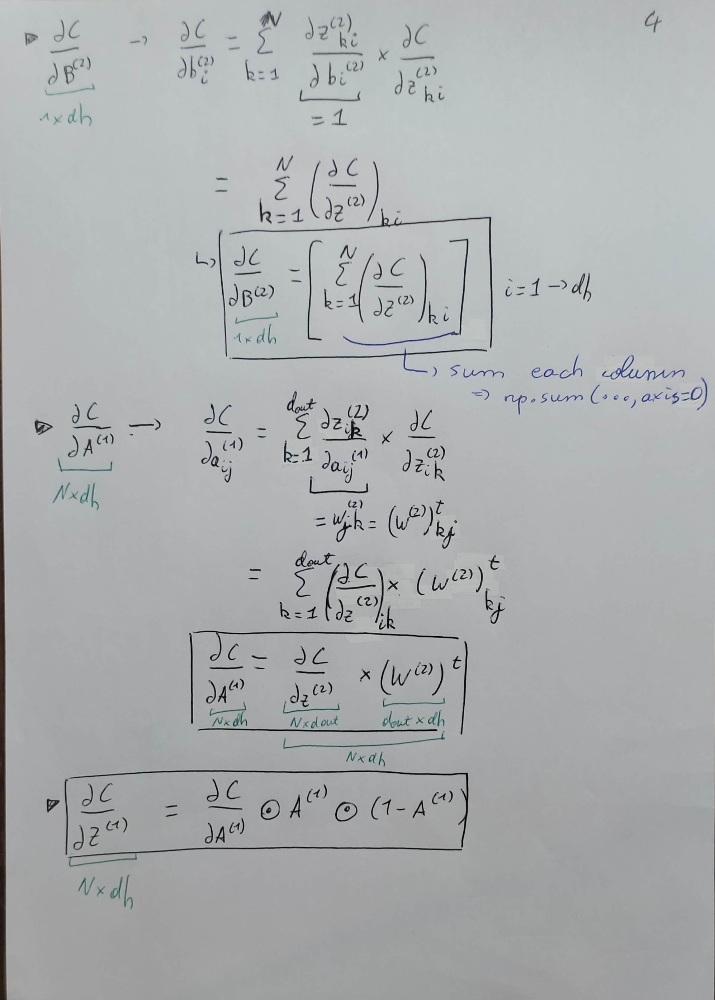
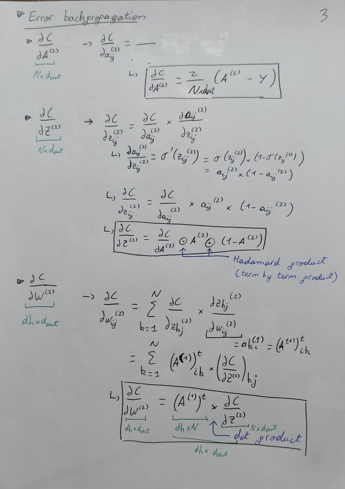
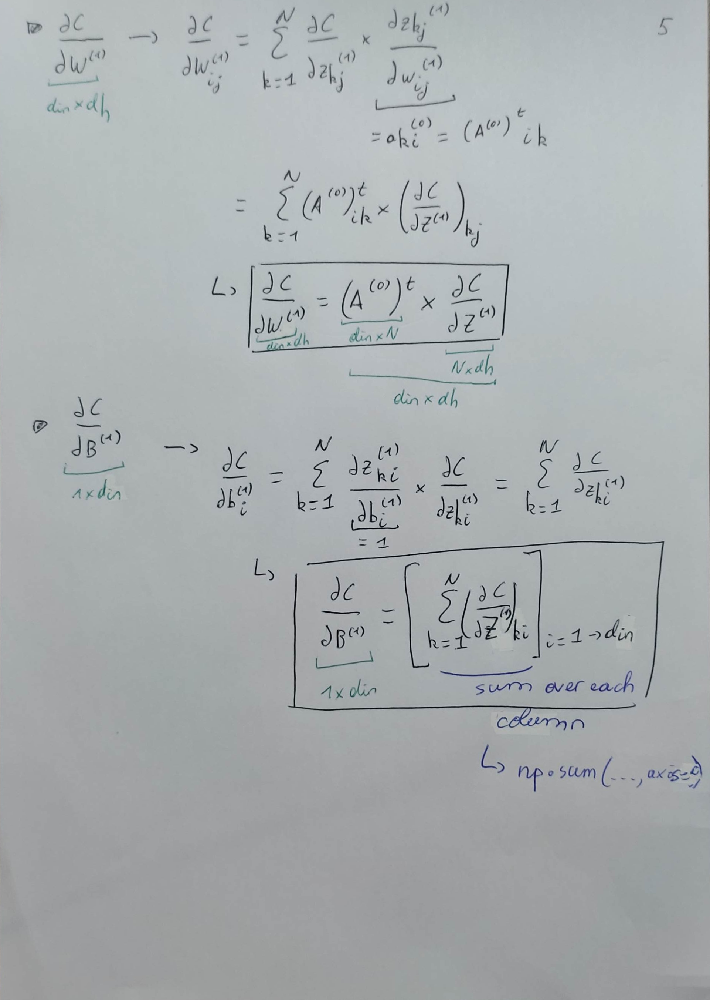

#### Example CIFAR 10
We finally choose to implement a softmax activation function on the output layer, and use this model on the cifar10 dataset
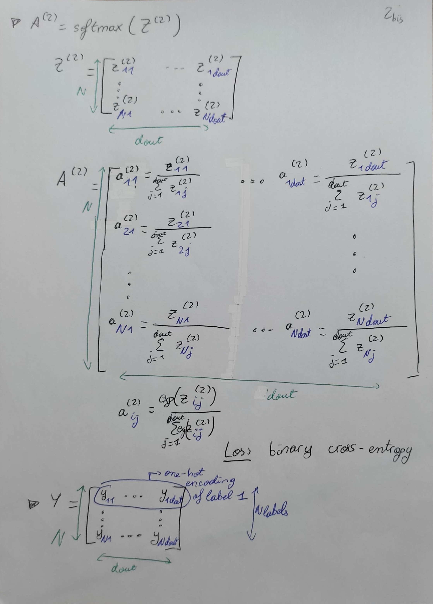
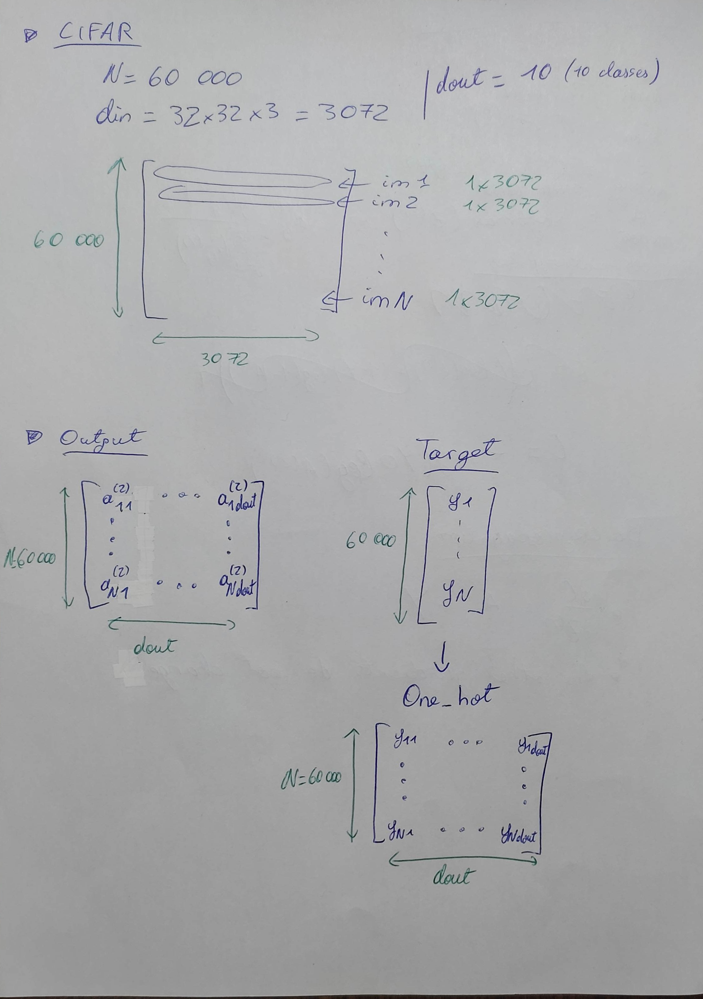
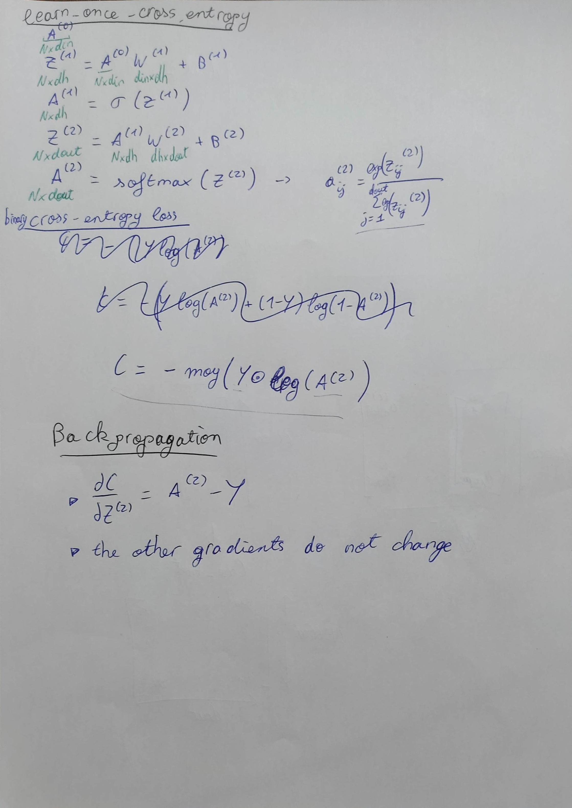
Good results :
